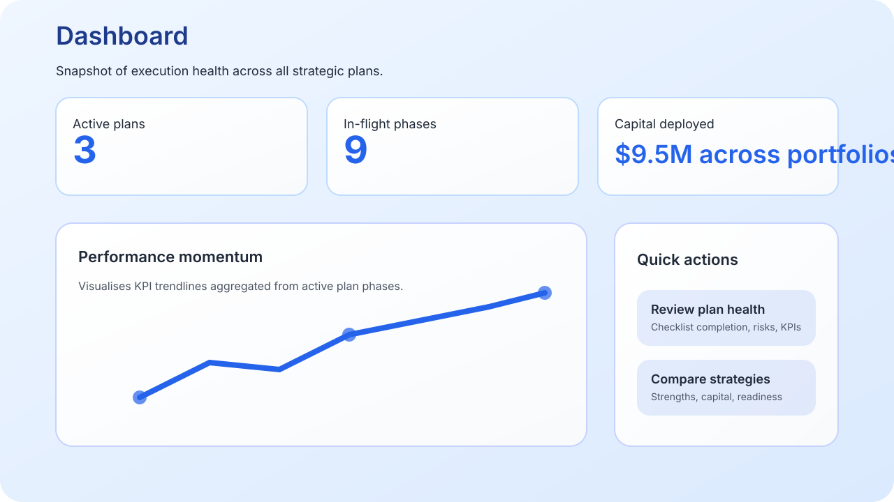
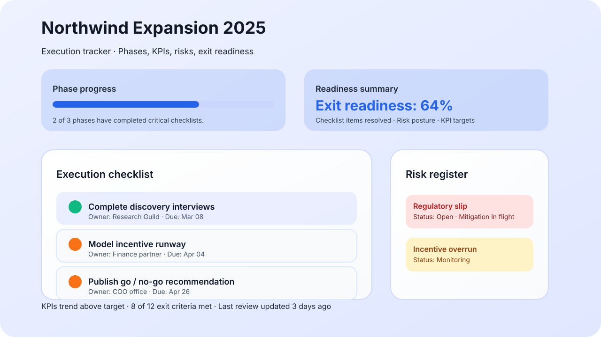

# Strategic Plan Tracker

A Next.js application for operations and strategy teams to compare strategic plans, track execution health, and prepare exit readiness across complex initiatives.



## Table of contents

- [Overview](#overview)
- [Screenshots](#screenshots)
- [Tech stack](#tech-stack)
- [Getting started](#getting-started)
- [Testing](#testing)
- [Content model](#content-model)
- [Accessibility](#accessibility)
- [Deployment on Vercel](#deployment-on-vercel)
- [Static export fallback](#static-export-fallback)
- [Project structure](#project-structure)
- [License](#license)

## Overview

The tracker provides a single workspace to:

- Compare strategic plans side-by-side to understand objectives, capital allocation, and current phase focus.
- Dive into detailed execution dashboards that capture KPIs, risks, checklists, and exit readiness for each initiative.
- Persist operational notes locally so programme managers can collaborate asynchronously without wiring up a backend yet.

The UI and content are optimised for leadership reviews, keeping progress indicators, risk posture, and critical milestones in one place.

## Screenshots

| Dashboard | Plan comparison | Plan detail |
| --- | --- | --- |
|  |  |  |

## Tech stack

- **Framework:** Next.js 13 App Router with React 18 and TypeScript
- **Styling:** Hand-crafted CSS with design tokens for spacing, colour, and elevation
- **State & persistence:** Client components with `useState` and a reusable `useLocalStorageState` hook
- **Content:** Static TypeScript modules describing three canonical strategic plans
- **Tooling:** ESLint, TypeScript strict mode, Vitest for lightweight unit coverage

## Getting started

### Prerequisites

- Node.js ≥ 18 (the Vercel deployment uses 18.x via `vercel.json`)
- npm ≥ 9 (bundled with Node 18)

### Installation

```bash
npm install
```

### Development workflow

| Command | Description |
| --- | --- |
| `npm run dev` | Start a local development server on <http://localhost:3000> |
| `npm run lint` | Check code style and catch common issues with ESLint |
| `npm run test` | Execute Vitest unit tests (fast, runs in Node environment) |
| `npm run typecheck` | Run TypeScript in no-emit mode to catch type regressions |
| `npm run build` | Create an optimised production build (required for Vercel) |
| `npm run start` | Serve the production build locally (uses `next start`) |
| `npm run export:static` | Produce a static export into `out/` by setting `STATIC_EXPORT=true` |

The build step succeeds with `npm run build`, matching the acceptance criteria and the Vercel deployment workflow.

## Testing

Vitest is configured via `vitest.config.ts` with path aliases that mirror the Next.js configuration. Tests live under `tests/` and can import modules directly from the application (for example the static `plans` data or the `generateStaticParams` helper). The default environment is Node, which keeps runtime low while still covering pure utility logic.

A minimal assertion exists to ensure `generateStaticParams` stays in sync with the structured plan data—acting as a guardrail when new plans are added.

To run tests continuously during development:

```bash
npm run test -- --watch
```

## Content model

The repository ships with a type-safe strategic planning dataset in `data/plans.ts`:

- `Plan` — top-level metadata (timeline, sponsor, capital, objectives, highlight tags) plus nested `phases`, `baselineRisks`, and an `exitChecklist`.
- `PlanPhase` — describes each execution phase with objectives, timeline milestones, capital breakdown, KPIs, risks, kill criteria, and a templated checklist.
- `PlanPhaseKpi` — captures KPI targets, units, directionality, and historical trend samples used to render analytics.
- `ChecklistTemplateItem`, `RiskTemplate`, and `ExitChecklistItem` — dedicated types for execution workflows, risk registers, and exit-readiness scoring.

The UI consumes these modules exclusively, so adding a new strategy is as simple as appending to the `plans` array without having to touch component logic.

## Accessibility

- Consistent semantic structure (`<main>`, `<section>`, `<header>`, `<table>`, etc.) keeps screen-reader navigation intuitive.
- All interactive elements (buttons, links, checkboxes) include visible focus styles and large touch targets ≥ 44px.
- Colour palettes meet WCAG AA contrast ratios, with textual cues supplementing colour when conveying status (e.g. badges, risk severity).
- Checklist inputs are labelled and grouped, and data tables use scoped headers for accurate narration.

Additional audits can be run locally with browser tooling because the app is purely client-side once the static payload has been delivered.

## Deployment on Vercel

1. **Create a new Vercel project** and connect the GitHub repository. The included `vercel.json` sets the node runtime (18.x) and points Vercel to the standard Next.js build command.
2. **Build configuration:**
   - Install Command: `npm install`
   - Build Command: `npm run build`
   - Output Directory: `.next`
3. **Environment variables:** none are required for the default deployment. The application is entirely static with client-side persistence.
4. **Preview & production:** each pull request will run the GitHub Actions CI workflow (`CI`) to lint, type-check, test, and build the project before Vercel attempts a deploy, keeping deployments healthy.

Once deployed, `next start` serves the statically generated HTML and JSON that power the app routes (`/plans` and `/plans/[id]`).

## Static export fallback

For environments where a Node runtime is unavailable (e.g. S3, Netlify Drop, GitHub Pages), trigger the `static-export` job in the GitHub Actions workflow with **Run workflow**. The job sets `STATIC_EXPORT=true` and runs `npm run export:static`, which leverages the environment-aware `next.config.js` to emit a static bundle into `out/`. The bundle is uploaded as an artifact that can be downloaded and hosted on any static file server.

Alternatively, run the same script locally and serve the `out/` directory with any static HTTP server.

## Project structure

```
├── app/
│   ├── layout.tsx           # Root layout and metadata
│   ├── page.tsx             # Landing view reusing the plan comparison
│   └── plans/
│       ├── page.tsx         # Comparison dashboard for strategic plans
│       └── [id]/page.tsx    # Dynamic plan detail tracker with KPIs & checklists
├── components/              # UI building blocks (PlanDetail, metric cards, etc.)
├── hooks/useLocalStorageState.ts
├── data/plans.ts            # Structured strategic plan content model
├── docs/images/             # Screenshot illustrations embedded in the README
├── public/                  # Static assets (currently empty but reserved)
├── next.config.js           # Environment-aware Next.js configuration
├── vercel.json              # Deployment settings for Vercel
├── tests/                   # Vitest unit coverage
└── vitest.config.ts
```

## License

This project is licensed under the [MIT License](LICENSE).
